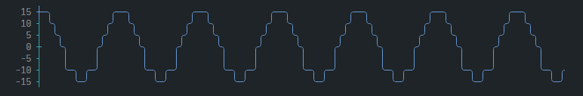
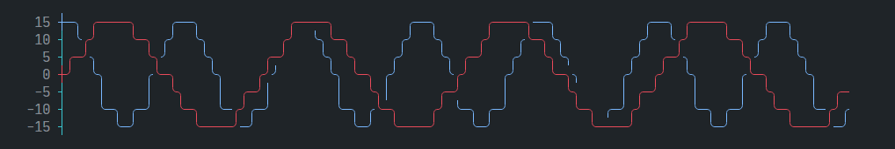
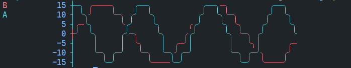
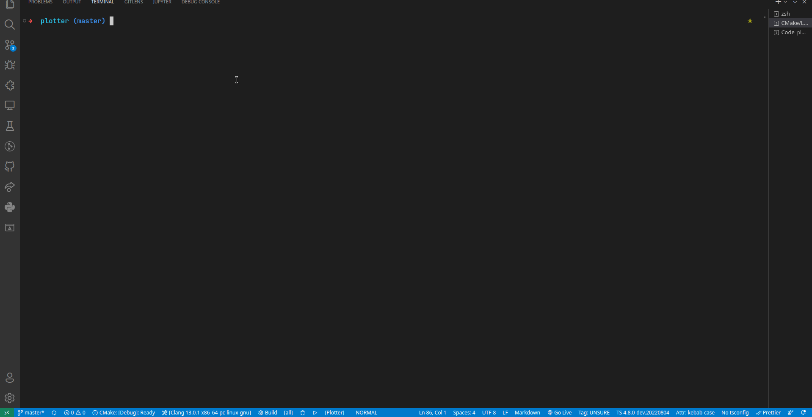

# asciichart

> A port of the npm package [asciichart](https://github.com/kroitor/asciichart) by Igor [Kroitor](https://github.com/kroitor).

Just used to plot ascii line charts, no dependencies.



## Usage

This is a header only library, you can copy all files in [include](./include) directory to your project.

## Options

The width of the chart equals to the length of data series. The height and range will be determined automatically. Users can specify:

1. height: height of chart.
2. offset: axis offset from the left (min 2).
3. colors: colors used in chart.
4. min: min value.
5. max: max value.
6. symbols: symbols used in chart.

## Examples

### Scale to Desired height

```c++
std::vector<double> series; // range from -15 to +15
for (int i = 0; i < 200; i += 2)
{
series.push_back(15 * std::cos(i * (kPI * 8) / 120));
}

Asciichart asciichart(std::vector<std::vector<double>>{series});
std::cout << '\n'
          << asciichart.height(10).Plot() // rescale to -3 ~ +3 lines
          << '\n';
```


### Multiple Series

```c++
std::vector<double> series;
for (int i = 0; i < 200; i += 2)
{
series.push_back(15 * std::cos(i * (kPI * 8) / 120));
}

std::vector<double> series2;
for (int i = 0; i < 200; i += 2)
{
series2.push_back(15 * std::sin(i * ((kPI * 4) / 100)));
}
Asciichart asciichart(std::vector<std::vector<double>>{series, series2});
std::cout  << '\n'
           << asciichart.height(6).Plot() 
           << '\n';
```



### Now it support Legend

```c++
void example_legend2() {
  using namespace ascii;
  std::vector<double> series;
  std::vector<double> series2;
  for (int i = 0; i < 100; i += 2) {
    series.push_back(15 * std::cos(i * (kPI * 8) / 120));
    series2.push_back(15 * std::sin(i * ((kPI * 4) / 100)));
  }
  Asciichart asciichart({{"A", series}, {"B", series2}});
  std::cout << asciichart.show_legend(true).height(6).Plot();
}
```

  

### Animation

```c++  
std::vector<double> series;
std::vector<double> series2;
int height = 6;
for (int i = 0; i < 100; i += 2) {
series.push_back(15 * std::cos(i * (kPI * 8) / 120));
series2.push_back(15 * std::sin(i * ((kPI * 4) / 100)));
Asciichart asciichart(std::vector<std::vector<double>>{series, series2});
if (i != 0) {
    for (int j = 0; j <= height; j++) {
    std::cout << "\033[A\033[2K";
    }
    std::this_thread::sleep_for(std::chrono::milliseconds(500));
}
std::cout << asciichart.height(height).Plot();
}
```


